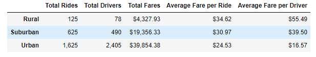

# Comparing Total Ride Fares from Urban, Suburban, and Rural Cities in 2019

## Overview of Project
The overall purpose of this project was to look at the total weekly fares from urban, suburban, and rural cities from January 1, 2019
to April 29, 2019. To better visualize the results, we plotted our findings on a multiple-line graph. We took the data from the 
city_data.csv and ride_data.csv files in the Resources folder and then created data frames to complete the analysis. 

## Results
Here is the final multiple-line graph and the data frame we produced.
### Graph

### Table

While there are some minor dips from week to week, you can clearly see taht urban cities consistently receive the most fares by a 
significant amount. The same can be said about rural cities barely receiving any fares in a given week. Then, when you look at the table
comparing the three types of cities, the average fare per driver is significantly higher for rural cities and suburban cities are also about 2.5 times
more than urban cities.  

## Summary

### First Recommendation
One recommendation I have is to slightly increase prices on the urban areas. As you can see, more than two-thirds of all the rides in
this time frame were from urban areas. Additionally, suburban and rual fares were slightly more expensive with way less drivers. With 
the demand much higher in urban areas, it makes sense to raise the prices.

### Second Recommendation
Another recommendation I have is to find a way to reduce the amount of drivers in urban areas. Just looking at the table above you can see
that over this time period there were more drivers than total rides. This could encourage drivers to go out to the suburban cities that might
not have as many drivers and generate more revenue there. Obviously, this is not the easiest thing to do since drivers essentially go where
they want but there could be ways to incentivise this.

### Third Recommendation
Lastly, I would recommend to increase the amount of drivers in suburban areas. The suburban area appears to be a great way to increase 
revenue because there is a decent amount of population and the areas are more spread out and thus could be a reason to use a ride share
service. The average fare per ride is not that much more than the city for how many available rides there are. 